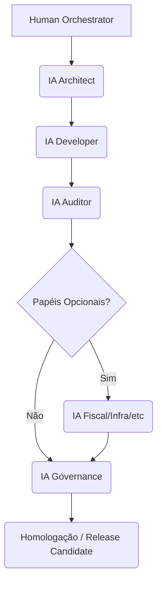

---

# Bloco de Identidade CrisAI Adicionado
framework_name: "CrisAI"
framework_acronym: "CRIS"
framework_meaning: "Cognitive Responsible Innovation System"
framework_tagline: "Inovação Cognitiva com Responsabilidade e Propósito"
framework_version: "1.4"
framework_named_for: "Cris Vicenzo"
document_type: "protocolo_governanca_ia_humano"
protocol_version: "v1.3"
document_status: "active"
governance_scope:
  - "Desenvolvimento assistido por IA"
  - "Orquestração Humano–IA"
  - "Governança Multiagente"
  - "Infraestrutura, Observabilidade e Segurança"
  - "Protocolo Corporativo Universal"
scope_type: "universal"
creation_date: "2025-11"
last_revision: "2025-11-02"
next_revision: "2026-04"
compatibility_note: |
  Protocolo v1.3 compatível com framework v1.4.
  Aplicável a todos os projetos da organização vicenzo_corp.
  Projetos específicos podem herdar e estender este protocolo.
---

# 🤖 PROTOCOLO DE GOVERNANÇA IA–HUMANO v1.3

## 1️⃣ OBJETIVO
Garantir a **construção segura, rastreável e eficiente** de sistemas complexos por múltiplas IAs sob orquestração humana.  
Define regras, papéis, fluxos e SLAs para o **desenvolvimento colaborativo entre agentes IA e especialistas humanos**.

**Escopo:** Este é o protocolo corporativo universal aplicável a todos os projetos. Projetos individuais podem criar protocolos específicos que herdam e estendem estas regras base.

---

## 2️⃣ PAPÉIS E RESPONSABILIDADES

### 📋 **Papéis Obrigatórios (Presentes em Todos os Projetos)**

| Papel | Responsabilidade Central | Acesso Principal |
|-------|--------------------------|------------------|
| 🧑‍💼 **Human Orchestrator** | Define escopo, supervisiona contexto e aprova entregas. | Todos os artefatos |
| 🧠 **IA Architect** | Estrutura conceitos, blueprint e arquitetura técnica. | `CONCEITO_TECH.md`, `README.md` |
| ⚙️ **IA Developer** | Implementa blocos técnicos e fluxos de código. | `TECH.md` ou derivados técnicos |
| 🧩 **IA Auditor** | Executa auditorias automáticas e contínuas; gera diffs, valida SHA256 e conformidade. | Todos os artefatos |
| 📊 **IA Governance** | Monitora conformidade com protocolos e mantém consistência documental entre agentes. | Todos os artefatos corporativos e de projeto |

### 🔧 **Papéis Opcionais (Definidos por Projeto)**

Projetos podem incluir papéis adicionais conforme necessidade:

| Papel | Quando Usar | Acesso Principal |
|-------|-------------|------------------|
| 🧾 **IA Fiscal** | Projetos com módulos tributários, fiscais e regulatórios | `EXT_FISCAL.md` |
| 🧰 **IA Infra** | Projetos com necessidade de gestão de infraestrutura e DevOps | Blueprints de infra, logs de CI/CD |
| 🔐 **IA Security** | Projetos com requisitos de segurança avançados | Documentos de segurança |
| 📈 **IA Data** | Projetos com ciência de dados e analytics | Documentos de dados |
| 🧪 **IA QA** | Projetos com necessidade de testes especializados | Planos de teste |

**Nota:** Papéis opcionais devem ser definidos no protocolo específico do projeto.

---

## 3️⃣ COMPONENTIZAÇàO

Cada entrega deve ser **atômica e independente**, com:
- Duração máxima: **16h de execução IA**;
- Input: contexto YAML + trecho do master;
- Output: arquivo `.md` versionado com SHA256;
- Validação: automática + humana (dupla camada).

Exemplo:

```yaml
component:
  name: "Workflow Engine Core"
  source: "PROJETO_CONCEITO_TECH.md"
  output: "PROJETO_TECH.md"
  max_duration: "16h"
  validator: ["ia_auditor", "human_orchestrator"]
```

---

## 4️⃣ CONTEXT PACK E CONTROLE DE TOKENS

Cada IA opera com um **Context Pack** de até **500 palavras**, incluindo:
- Trecho do documento master (SSoT);
- Instrução específica da tarefa;
- YAML de controle de escopo;
- Critérios de aceite e validação.

Benefícios:
- Economia de até **60% de tokens**;
- Controle semântico e contextual;
- Isolamento entre agentes.

---

## 5️⃣ FLUXO DE ENTREGA MULTIAGENTE



### **Fluxo Base (Obrigatório):**
1️⃣ **IA Architect** cria blueprint a partir do conceito master.  
2️⃣ **IA Developer** implementa blocos técnicos conforme blueprint.  
3️⃣ **IA Auditor** valida integridade, SHA256 e diffs.  
4️⃣ **IA Governance** verifica conformidade com protocolos e padrões.  
5️⃣ **Human Orchestrator** revisa e aprova para release.

### **Fluxo Estendido (Quando Aplicável):**
- Papéis opcionais (IA Infra, IA Fiscal, etc.) entram após IA Auditor
- Executam tarefas especializadas do projeto
- Validação final sempre passa por IA Governance → Human Orchestrator

---

## 6️⃣ SLA DE EXECUÇàO E REVISàO

| Etapa | Responsável | SLA | Ação |
|--------|--------------|-----|------|
| Execução IA → Revisão Humana | Human Orchestrator | 48h | Feedback obrigatório |
| Retrabalho IA | Mesma IA | 24h | Novo commit com diff log |
| Auditoria Contínua | IA Auditor | 72h | Emissão de relatório automático |
| Validação de Conformidade | IA Governance | 24h | Verificação de protocolos |
| Observabilidade de Infra* | IA Infra | 24h | Atualização de dashboard |

*Quando aplicável ao projeto

---

## 7️⃣ POLÍTICA DE ROLLBACK

Em caso de inconsistência:
- Criação de branch `rollback/[data]/[hash]`;
- Restauração automática via SHA256;
- Log completo arquivado em `/governance/auditoria/rollback/`;
- IA Auditor notifica o Human Orchestrator e bloqueia branch de release até revisão;
- IA Governance documenta o incidente e atualiza protocolos se necessário.

---

## 8️⃣ SEGURANÇA E GOVERNANÇA DE TOKENS

- Tokens de autenticação e API são **rotacionados automaticamente** a cada ciclo de entrega;  
- Contextos sensíveis são mascarados por IA Auditor;  
- Logs contêm apenas metadados, nunca conteúdo confidencial;  
- Todos os agentes IA devem operar em **ambientes isolados de execução (sandboxed)**;
- IA Governance monitora acessos e valida conformidade de segurança.

---

## 9️⃣ PADRÕES DE CÓDIGO E DESIGN SYSTEM

**Nota:** Padrões específicos de tecnologia devem ser definidos no protocolo de cada projeto.

**Padrões Universais:**
- Controle de versão com Git
- Conventional Commits
- Documentação inline e externa
- Testes automatizados (quando aplicável)
- Code review obrigatório (IA Auditor + Human)

**Exemplo de Stack (referência - não obrigatório):**
- Back-End: Node.js (NestJS), Python, Go, etc.
- Banco de Dados: PostgreSQL, MySQL, MongoDB, etc.
- Front-End: React, Vue, Angular, etc.
- CI/CD: GitHub Actions, GitLab CI, Jenkins, etc.
- Containerização: Docker, Kubernetes (quando necessário)

---

## 🔟 OBSERVABILIDADE E INFRAESTRUTURA

**Para projetos que necessitam:**
- **Topologia:** Definida no blueprint de infraestrutura
- **Monitoração:** Prometheus, Grafana, Datadog, etc.
- **Deploy:** Docker, Kubernetes, ou outro conforme projeto
- **Logs:** Centralizados (ELK, CloudWatch, etc.)
- **Alertas:** via Webhooks integrados com IA Auditor
- **Backups:** Política definida por projeto

**Responsável:** IA Infra (quando papel é incluído no projeto)

---

## 1️⃣1️⃣ RASTREABILIDADE E AUDITORIA CONTÍNUA

Cada entrega:
- Inclui SHA256 no rodapé;  
- É auditada automaticamente via IA Auditor;  
- É registrada em `/governance/auditoria/[projeto]/[release]/`;  
- Pode ser rastreada até o commit original no Git;
- É verificada por IA Governance para conformidade protocolar.

IA Auditor gera um relatório em Markdown com diffs e status de integridade (✅ ou ❌).

---

## 1️⃣2️⃣ CRITÉRIOS DE ACEITE

Uma entrega é aprovada quando:
- Cumpre escopo YAML;  
- Passa em validação IA Auditor (integridade técnica);
- Passa em validação IA Governance (conformidade protocolar);  
- Está dentro dos SLAs definidos;  
- É confirmada via hash por 2 entidades (IA + humano);
- Documentação está completa e atualizada.

---

## 1️⃣3️⃣ GOVERNANÇA MULTIAGENTE

O sistema pode operar em modo **paralelo**:
- Múltiplas IAs atuando em componentes distintos;  
- Contextos isolados por namespace;  
- Mecanismo de sincronização via *Governance Bus* (mensageria);
- IA Governance coordena consistência entre agentes.

O *Governance Bus* assegura:
- Consistência de contexto entre agentes
- Prevenção de conflitos de escrita
- Rastreabilidade de interações entre IAs
- Auditoria de comunicações multiagente

---

## 1️⃣4️⃣ REVISÕES E EVOLUÇàO DO PROTOCOLO

| Versão | Data | Mudança Principal |
|---------|------|------------------|
| v1.0 | 2025-10 | Criação do protocolo inicial |
| v1.1 | 2025-11 | Adição de SLAs, rollback e rastreabilidade |
| v1.2 | 2025-11 | Inclusão de infraestrutura, segurança e observabilidade |
| **v1.3** | **2025-11** | Adição da Seção 16 – Hierarquia SSoT + papel IA Governance + escopo universal |

### **Compatibilidade Framework:**
- ✅ Compatível com framework v1.4
- ✅ Retrocompatível com v1.2 e v1.1
- ✅ Aplicável a qualquer domínio de negócio
- ✅ Suporta herança por protocolos específicos de projeto

---

## 1️⃣5️⃣ PROTOCOLOS ESPECÍFICOS DE PROJETO

Projetos podem criar protocolos específicos que **herdam** este protocolo base.

**Estrutura:**
```yaml
---
document_type: "protocolo_governanca_ia_humano"
protocol_version: "v1.3"
project_name: "NomeDoProjeto"
inherits_from: "PROTOCOLO_GOVERNANCA_IA_HUMANO_v1.3.md"
extends:
  - "Papéis adicionais (IA Fiscal, IA Infra, etc.)"
  - "Regras específicas de tecnologia"
  - "SLAs customizados"
  - "Fluxos especializados"
---
```

**Exemplo:**
- `PROTOCOLO_GOVERNANCA_IA_HUMANO_DOCKMANAGER_v1.3.md`
  - Herda: Este protocolo universal
  - Adiciona: IA Fiscal, IA Infra como obrigatórios
  - Define: Stack Node.js/React/PostgreSQL
  - Customiza: Fluxos tributários específicos

---

## 1️⃣6️⃣ HIERARQUIA SSoT (SINGLE SOURCE OF TRUTH)

O framework adota a hierarquia SSoT para governança documental e automação IA:

### **📄 Master Document**
- Arquivo: `<PROJETO>_CONCEITO_TECH.md`
- Papel: Single Source of Truth do projeto
- Conteúdo: Conceito integral, todas as seções e apêndices
- Edição: **Apenas por humanos** (com aprovação de governance)

### **📑 Derived Documents**
- Exemplos:
  - `<PROJETO>_TECH.md` → Subconjunto técnico
  - `<PROJETO>_EXT_<ESPECIALIDADE>.md` → Subconjuntos especializados
- Geração: **Automatizada via IA** sob controle de auditoria
- Header: Contém `derived_from` apontando para o master
- Validação: IA Auditor + IA Governance

### **🔒 Governança e Auditoria**
- Apenas o documento master pode ser editado manualmente
- Derivados são reconstruídos automaticamente quando master muda
- Logs e hashes de derivação mantidos em `/governance/auditoria/ssot/`
- IA Governance valida consistência da hierarquia
- IA Auditor verifica integridade via SHA256

### **📊 Benefícios**
- Consistência absoluta entre documentos
- Economia de tokens (context packs especializados)
- Rastreabilidade completa de mudanças
- Prevenção de divergências entre agentes
- Auditoria automatizada e contínua

---

## 1️⃣7️⃣ CONCLUSàO

O **Protocolo de Governança IA-Humano v1.3** estabelece:
- Papéis obrigatórios para todos os projetos (incluindo IA Governance)
- Papéis opcionais para necessidades específicas
- Fluxos de trabalho multiagente rastreáveis
- SLAs claros para execução e revisão
- Hierarquia SSoT para governança documental
- Base para protocolos específicos de projeto

> Este protocolo é a **fonte normativa universal** do desenvolvimento assistido por IA na organização vicenzo_corp, compatível com framework v1.4.

### **Aplicabilidade**
✅ **Universal:** Aplicável a qualquer projeto, domínio ou stack tecnológico  
✅ **Extensível:** Projetos podem herdar e estender com regras específicas  
✅ **Auditável:** Rastreabilidade completa via IA Auditor e IA Governance  
✅ **Evolutivo:** Suporta revisões incrementais mantendo compatibilidade

---

**Documento validado e aprovado para uso em todo portfólio de projetos.**
