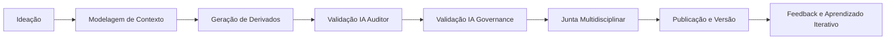
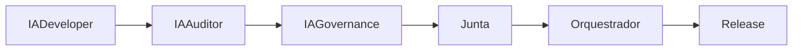
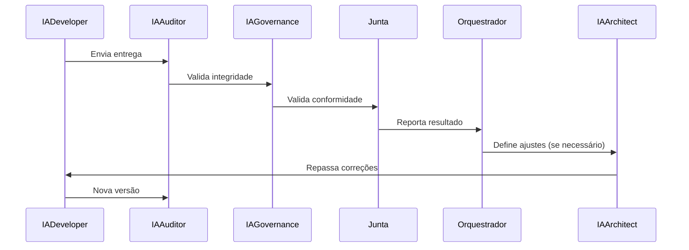

---
# Bloco de Identidade CrisAI Adicionado
framework_name: "CrisAI"
framework_acronym: "CRIS"
framework_meaning: "Cognitive Responsible Innovation System"
framework_tagline: "Inovação Cognitiva com Responsabilidade e Propósito"
framework_version: "1.4"
framework_named_for: "Cris Vicenzo"
title: "PROTOCOLO_METODOLÓGICO_CORPORATIVO_IA_HUMANO_v1.0"
version: 1.0
author: "Junta Validadora + Orquestrador Humano"
date: 2025-11-02
status: "Aprovado para uso corporativo"
repository: "governance/meta/"
compatibility_note: |
  Protocolo metodológico v1.0 compatível com framework v1.4.
  Define como criar protocolos de projeto, não o conteúdo de projetos específicos.
---

# 🧭 PROTOCOLO METODOLÓGICO CORPORATIVO IA-HUMANO v1.0

Guia normativo para criação, execução e governança de projetos orquestrados entre agentes de IA e especialistas humanos.

---

## 1. PROPÓSITO
Formalizar o método de desenvolvimento colaborativo IA-Humano adotado pela organização, consolidando as práticas de sucesso aplicadas no projeto **DockManager** como padrão corporativo para futuros projetos.

Este documento define **como criar protocolos de projeto**, não o conteúdo de um projeto específico.

---

## 2. PRINCÍPIOS FUNDAMENTAIS
- **Colaboração Simbiótica:** IA e humanos não competem; se complementam.  
- **Governança Iterativa:** Toda decisão automatizada é revisável por um humano.  
- **Auditabilidade Completa:** Nenhum artefato é aceito sem trilha de auditoria.  
- **Fonte Única da Verdade (SSoT):** Cada protocolo tem um documento master e seus derivados controlados.  
- **Autonomia e Contexto Limitado:** Cada IA trabalha dentro de escopo delimitado e rastreável.

---

## 3. ESTRUTURA HIERÁRQUICA DE DOCUMENTOS
```yaml
ssot_hierarchy:
  master: "CONCEITO_TECH.md"
  derived:
    - "TECH.md"
    - "EXT_FISCAL.md"
  governance:
    - "PROTOCOLO_GOVERNANCA_IA_HUMANO_v1.3.md"
    - "PROTOCOLO_METODOLÓGICO_CORPORATIVO_IA_HUMANO_v1.0.md"
```
Cada projeto deve declarar explicitamente sua hierarquia documental e manter rastreabilidade entre master e derivados.

---

## 4. PROCESSO DE CRIAÇàO DE PROTOCOLOS
1. **Ideação:** O orquestrador humano define o propósito e escopo.  
2. **Modelagem de Contexto:** O IA Architect cria o modelo conceitual.  
3. **Extração de Seções:** As IAs geram documentos derivados (técnico, fiscal, etc.) seguindo o SSoT.  
4. **Validação e Revisão:** Junta multidisciplinar e IA Auditor verificam coerência, integridade e rastreabilidade.  
5. **Publicação:** O protocolo é versionado e movido para o repositório oficial.  

---

## 5. GOVERNANÇA E PAPÉIS

### 5.1 Papéis Obrigatórios
| Papel | Responsabilidade | Natureza |
|-------|------------------|-----------|
| **Orquestrador Humano** | Coordena IAs, aprova versões e conduz a estratégia | Humano |
| **IA Architect** | Cria e mantém a estrutura conceitual | IA |
| **IA Developer** | Implementa os módulos derivados | IA |
| **IA Auditor** | Verifica integridade documental e gera hashes | IA |
| **IA Governance** | Monitora conformidade com protocolos e mantém consistência documental | IA |
| **Junta Multidisciplinar** | Valida coerência, riscos e compliance | Humano |

### 5.2 Papéis Opcionais
Projetos podem incluir papéis adicionais conforme necessidade:
- **IA Fiscal:** Módulos tributários e regulatórios
- **IA Infra:** Infraestrutura e DevOps
- **IA Security:** Segurança e compliance
- **IA Data:** Ciência de dados e analytics
- **IA QA:** Testes especializados

---

## 6. PIPELINE METODOLÓGICO PADRàO


---

## 7. CONTEXTO E ECONOMIA DE TOKENS
Cada agente IA deve operar com um *context pack* máximo de **500 palavras**, contendo apenas o necessário para sua função.
A redução de tokens preserva coerência, eficiência e minimiza contaminação de contexto.

---

## 8. GOVERNANÇA IA-HUMANO E JUNTA MULTIDISCIPLINAR
A governança IA-Humano é o núcleo de controle de qualidade e conformidade.

### 8.1 Princípio Geral
Cada projeto deve instituir uma **Junta Multidisciplinar**, gate humano de qualidade, atuando antes da homologação final e complementando o IA Auditor.

### 8.2 Funções Mínimas da Junta
- **Validador de Negócio:** garante alinhamento estratégico.  
- **Validador Técnico:** avalia integridade e eficiência técnica.  
- **Validador de Conformidade:** assegura aderência normativa.  
- **Validador de Usuário:** confirma aplicabilidade e valor percebido.  
- **IA Auditor:** valida integridade e rastreabilidade documental.
- **IA Governance:** verifica conformidade com protocolos corporativos.

### 8.3 Autonomia de Instanciação
Cada projeto define as especialidades correspondentes a essas funções:
```yaml
validation_team:
  business: "Especialista em Operações e Produto"
  technical: "Arquiteto de Sistemas"
  compliance: "Analista de Riscos e Conformidade"
  user: "Gestor de Experiência do Cliente"
  auditor: "IA_Auditor"
  governance: "IA_Governance"
```

### 8.4 Processo de Validação


### 8.5 Mapeamento de Habilidades
Cada ciclo de blueprint deve atualizar o YAML de habilidades com as competências necessárias ao produto.

### 8.6 Objetivos de Governança
- Rastreabilidade total entre IA e decisões humanas.  
- Nenhuma entrega sem dupla validação (IA + Humano).  
- Feedbacks e correções formalizados.  
- Equilíbrio entre automação e julgamento humano.

---

## 9. CICLO DE REFINAMENTO ITERATIVO
Processo contínuo IA ↔ Humano ↔ IA, estruturado como:

Cada iteração gera logs, hashes e versão incremental.

---

## 10. AUDITORIA E RASTREABILIDADE
- Todas as entregas são acompanhadas de **hash SHA256** e **timestamp**.  
- Logs imutáveis mantidos por 5 anos.  
- Auditorias automáticas (IA Auditor) e humanas (Junta) executadas por ciclo.  
- IA Governance verifica conformidade protocolar contínua.
- Qualquer divergência gera um *diff-report* automatizado.

---

## 11. INFRAESTRUTURA DE EXECUÇàO (IA INFRA)
- Versionamento via Git + tagging semântico.  
- Observabilidade com Prometheus, Grafana e ELK Stack.  
- Segurança: rotação de tokens, sandboxing e isolamento de contexto.  
- Pipelines orquestrados em Kubernetes ou ambiente equivalente.

---

## 12. MÉTRICAS DE EFICIÊNCIA COLABORATIVA
| Métrica | Descrição | Meta |
|----------|------------|------|
| % de Entregas Validadas sem Retrabalho | Medida de acurácia IA + Junta | > 90% |
| Tempo Médio de Iteração | Tempo entre entrega e revalidação | < 48h |
| Economia de Tokens | Eficiência contextual | > 30% |
| Aderência a SSoT | Conformidade documental | 100% |
| Conformidade Protocolar | Validação IA Governance | 100% |

---

## 13. EVOLUÇàO E REVISàO
- Este protocolo deve ser revisado a cada 6 meses pela Junta Corporativa.  
- Revisões incrementais seguem versionamento semântico (ex: v1.1, v1.2).  
- Novos projetos devem adotar a versão mais recente.
- Compatibilidade com framework é mantida via header YAML.

---

## 14. CONCLUSàO
Este documento representa a consolidação do aprendizado organizacional obtido com o projeto **DockManager**, formalizando uma metodologia replicável de desenvolvimento colaborativo IA-Humano.

Ao aplicar este protocolo, qualquer novo projeto corporativo poderá orquestrar inteligências artificiais e humanas de forma eficiente, auditável e escalável, mantendo coerência com a cultura de governança já estabelecida.

### Compatibilidade Framework
✅ **Compatível com framework v1.4**  
✅ Estabelece base metodológica para todos os projetos  
✅ Define papéis obrigatórios universais (incluindo IA_Governance)  
✅ Suporta extensão com papéis opcionais por projeto

---

**Fim do Documento**
