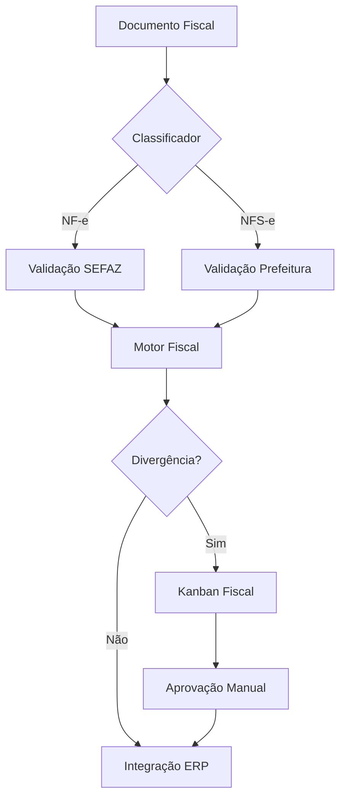

# DOCK_MANAGER_v13_EXT_FISCAL

> Extensão tributária e fiscal com integração de motores fiscais e APIs especializadas
> Módulo complementar para compliance e gestão tributária

## 1. VISÃO GERAL DO MÓDULO FISCAL

Este módulo complementa o DockManager v13 com capacidades específicas para:
- Classificação automática fiscal de documentos
- Integração com motores fiscais externos
- Validação tributária automatizada
- Gestão de NFS-e e documentos de serviço
- Compliance com SEFAZ e prefeituras

## 2. COMPONENTES FISCAIS

### 2.1 Motor Fiscal Externo

**Integração via API com provedores especializados:**
- OneSource (Thomson Reuters)
- Avalara
- Senior/Braspress
- Mastermaq

### 2.2 Node "Validar Tributação"

```yaml
Node: ValidarTributacao
Tipo: Processamento
Entradas:
  - XML do documento
  - CNPJ emissor/destinatário
  - NCM dos produtos
Processamento:
  - Consulta tabela CEST
  - Calcula MVA/ST
  - Valida alíquotas
  - Aplica regras estaduais
Saídas:
  - Status: Válido/Inválido
  - Divergências encontradas
  - Valores calculados
```

### 2.3 Regras ST/MVA/CEST

| UF Origem | UF Destino | NCM | CEST | MVA% | ST% |
|-----------|------------|-----|------|------|-----|
| SP | RJ | 8471.30.12 | 21.005.00 | 42.72 | 18.00 |
| SP | MG | 8471.30.12 | 21.005.00 | 38.53 | 18.00 |
| MG | SP | 2203.00.00 | 03.010.00 | 140.00 | 18.00 |

## 3. KANBAN FISCAL

### 3.1 Estrutura do Kanban Administrativo/Fiscal

```
| Pendente Análise | Em Validação | Aprovação Fiscal | Integrado |
|------------------|--------------|------------------|-----------|
| NFS-e 001        | NFS-e 003    | NFS-e 005        | NFS-e 007 |
| CT-e 002         | CT-e 004     | NFSE 006         | CT-e 008  |
```

### 3.2 Roteamento Fiscal

**Critérios de roteamento para Kanban Fiscal:**
- Documento tipo NFS-e → Sempre Kanban Fiscal
- NF-e com CFOP 5.933/6.933 → Kanban Fiscal
- Documentos com retenção → Kanban Fiscal
- CT-e com ICMS-ST → Kanban Fiscal

## 4. CONECTORES FISCAIS

### 4.1 Tabela de Conectores Disponíveis

| Provedor | Endpoint | Tipo | Status | Descrição |
|----------|----------|------|--------|-----------|
| SEFAZ-SP | https://nfe.fazenda.sp.gov.br | SOAP | Ativo | Consulta NF-e |
| SEFAZ-RJ | https://nfe.fazenda.rj.gov.br | SOAP | Ativo | Consulta NF-e |
| ISS-SP | https://nfe.prefeitura.sp.gov.br | REST | Ativo | NFS-e São Paulo |
| OneSource | https://api.onesource.com/v2 | REST | Config | Motor tributário |
| Avalara | https://api.avalara.com | REST | Config | Cálculo impostos |

### 4.2 Configuração de Tolerâncias Fiscais

```yaml
tolerancias:
  divergencia_valor_max: 0.01  # R$ 0,01
  divergencia_percentual_max: 0.1  # 0.1%
  prazo_regularizacao: 48  # horas
  escalonamento_fiscal:
    nivel_1: "Analista Fiscal"
    nivel_2: "Coordenador Fiscal"
    nivel_3: "Gerente Tributário"
```

## 5. AUDITORIA FISCAL INTEGRADA

### 5.1 Logs Fiscais com SHA256

Todos os eventos fiscais geram logs imutáveis:
```json
{
  "timestamp": "2025-11-02T10:30:00Z",
  "evento": "validacao_fiscal",
  "documento": "NFS-e-2025-001234",
  "hash_anterior": "a665a459204...",
  "hash_atual": "b776b560315...",
  "resultado": "divergencia_mvA",
  "valor_divergente": 125.43,
  "auditor": "sistema",
  "retencao_anos": 5
}
```

### 5.2 Retenção Legal

- Documentos fiscais: 5 anos (conforme legislação)
- Logs de auditoria: 5 anos
- Backup em conformidade com LGPD

## 6. FLUXO DE PROCESSAMENTO FISCAL



## 7. INTEGRAÇÃO COM ERP - MÓDULO FISCAL

### 7.1 Campos Específicos Fiscais

```javascript
{
  "fiscal_data": {
    "cfop": "5.102",
    "cst": "00",
    "ncm": "8471.30.12",
    "cest": "21.005.00",
    "base_icms": 1000.00,
    "valor_icms": 180.00,
    "base_st": 1427.20,
    "valor_st": 256.90,
    "mva": 42.72,
    "reducao_base": 0.00,
    "origem": 0,
    "modalidade_bc": 3
  }
}
```

## 8. COMPLIANCE E CONFORMIDADE

### 8.1 Requisitos Atendidos

- ✅ SPED Fiscal
- ✅ SPED Contribuições  
- ✅ EFD-ICMS/IPI
- ✅ Bloco K (quando aplicável)
- ✅ e-Social (integração RH)
- ✅ LGPD (dados fiscais sensíveis)

### 8.2 Certificados Digitais

- Suporte A1 (arquivo)
- Suporte A3 (token/smartcard)
- Renovação automática alertas
- Multi-certificado por filial

---

> **Nota Final:** Este módulo fiscal é opcional e pode ser ativado conforme necessidade do cliente.
> A IA Preditiva NÃO se aplica a fluxos fiscais, apenas ao fluxo físico de mercadorias.
