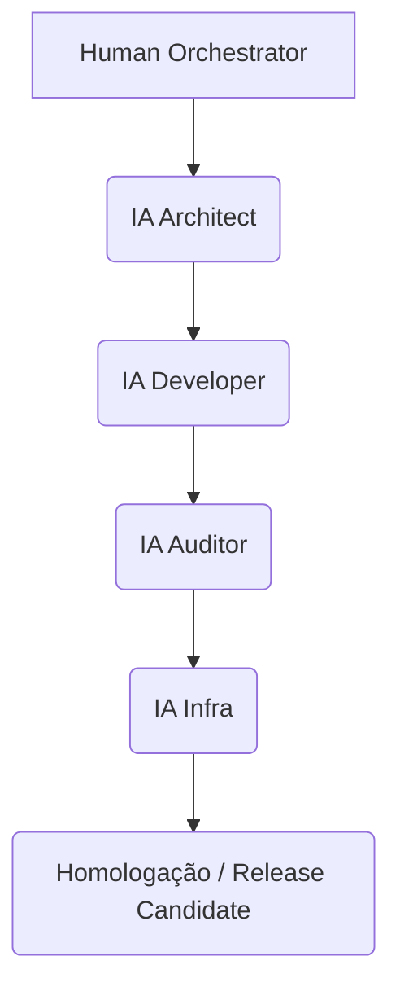

# 🤖 PROTOCOLO DE GOVERNANÇA IA–HUMANO v1.2

## 1️⃣ OBJETIVO
Garantir a **construção segura, rastreável e eficiente** de sistemas complexos por múltiplas IAs sob orquestração humana.  
Define regras, papéis, fluxos e SLAs para o **desenvolvimento colaborativo entre agentes IA e especialistas humanos**.

---

## 2️⃣ PAPÉIS E RESPONSABILIDADES

| Papel | Responsabilidade Central | Acesso Principal |
|-------|--------------------------|------------------|
| 🧑‍💼 **Human Orchestrator** | Define escopo, supervisiona contexto e aprova entregas. | Todos os artefatos |
| 🧠 **IA Architect** | Estrutura conceitos, blueprint e arquitetura técnica. | `CONCEITO_TECH.md`, `README.md` |
| ⚙️ **IA Developer** | Implementa blocos técnicos e fluxos de código. | `TECH.md` |
| 🧾 **IA Fiscal** | Gere módulos tributários, fiscais e regulatórios. | `EXT_FISCAL.md` |
| 🧩 **IA Auditor** | Executa auditorias automáticas e contínuas; gera diffs, valida SHA256 e conformidade. | Todos os artefatos |
| 🧰 **IA Infra** (Novo) | Configura pipelines, containerização e monitoração. | Infra Bloco 5 e logs de CI/CD |

---

## 3️⃣ COMPONENTIZAÇÃO

Cada entrega deve ser **atômica e independente**, com:
- Duração máxima: **16h de execução IA**;
- Input: contexto YAML + trecho do master;
- Output: arquivo `.md` versionado com SHA256;
- Validação: automática + humana (dupla camada).

Exemplo:

```yaml
component:
  name: "DockBot Workflow Engine"
  source: "DOCK_MANAGER_v13_CONCEITO_TECH.md"
  output: "DOCK_MANAGER_v13_TECH.md"
  max_duration: "16h"
  validator: ["ia_auditor", "human_orchestrator"]
```

---

## 4️⃣ CONTEXT PACK E CONTROLE DE TOKENS

Cada IA opera com um **Context Pack** de até **500 palavras**, incluindo:
- Trecho do documento master (SSoT);
- Instrução específica da tarefa;
- YAML de controle de escopo;
- Critérios de aceite e validação.

Benefícios:
- Economia de até **60% de tokens**;
- Controle semântico e contextual;
- Isolamento entre agentes.

---

## 5️⃣ FLUXO DE ENTREGA MULTIAGENTE



1️⃣ **IA Architect** cria blueprint.  
2️⃣ **IA Developer** implementa blocos técnicos.  
3️⃣ **IA Auditor** valida integridade, SHA256 e diffs.  
4️⃣ **IA Infra** executa deploy e monitora logs.  
5️⃣ **Human Orchestrator** revisa e aprova.

---

## 6️⃣ SLA DE EXECUÇÃO E REVISÃO

| Etapa | Responsável | SLA | Ação |
|--------|--------------|-----|------|
| Execução IA → Revisão Humana | Human Orchestrator | 48h | Feedback obrigatório |
| Retrabalho IA | Mesma IA | 24h | Novo commit com diff log |
| Auditoria Contínua | IA Auditor | 72h | Emissão de relatório automático |
| Observabilidade de Infra | IA Infra | 24h | Atualização de dashboard |

---

## 7️⃣ POLÍTICA DE ROLLBACK

Em caso de inconsistência:
- Criação de branch `rollback/[data]/[hash]`;
- Restauração automática via SHA256;
- Log completo arquivado em `/audits/rollback/`;
- IA Auditor notifica o Human Orchestrator e bloqueia branch de release até revisão.

---

## 8️⃣ SEGURANÇA E GOVERNANÇA DE TOKENS

- Tokens de autenticação e API são **rotacionados automaticamente** a cada ciclo de entrega;  
- Contextos sensíveis são mascarados por IA Auditor;  
- Logs contêm apenas metadados, nunca conteúdo confidencial;  
- Todos os agentes IA devem operar em **ambientes isolados de execução (sandboxed)**.

---

## 9️⃣ PADRÕES DE CÓDIGO E DESIGN SYSTEM

- Linguagens: Node.js (NestJS), Python  
- Banco de Dados: PostgreSQL / Redis  
- Mensageria: RabbitMQ / Kafka  
- Front-End: React + Tailwind + Shadcn/UI  
- Estilo: ESLint + Prettier + Conventional Commits  
- Arquitetura: Microfronts e Microsserviços containerizados  
- CI/CD: GitHub Actions + Docker/K8s + Observabilidade Prometheus/Grafana

---

## 🔟 OBSERVABILIDADE E INFRAESTRUTURA (BLOCO 5)

O Bloco 5 é tratado como **pilar técnico autônomo**, responsável por:
- **Topologia:** Microservices + Gateways  
- **Monitoração:** Prometheus / Grafana  
- **Deploy:** Docker + Kubernetes  
- **Logs:** Centralizados via Elastic Stack (ELK)  
- **Alertas:** via Webhooks e canais IA Auditor  
- **Backups automáticos** e snapshots semanais.  

IA Infra é o agente responsável por gerar o *Infra Blueprint YAML*, descrevendo a estrutura e o provisionamento.

---

## 11️⃣ RASTREABILIDADE E AUDITORIA CONTÍNUA

Cada entrega:
- Inclui SHA256 no rodapé;  
- É auditada automaticamente via IA Auditor;  
- É registrada em `/audit-trails/[release]/`;  
- Pode ser rastreada até o commit original no Git.  

IA Auditor gera um relatório em Markdown com diffs e status de integridade (✅ ou ❌).

---

## 12️⃣ CRITÉRIOS DE ACEITE

Uma entrega é aprovada quando:
- Cumpre escopo YAML;  
- Passa em validação IA Auditor;  
- Está dentro dos SLAs definidos;  
- É confirmada via hash por 2 entidades (IA + humano).

---

## 13️⃣ GOVERNANÇA MULTIAGENTE

O sistema pode operar em modo **paralelo**:
- Múltiplas IAs atuando em componentes distintos;  
- Contextos isolados por namespace;  
- Mecanismo de sincronização via *Governance Bus* (mensageria).  

O *Governance Bus* assegura consistência e coordenação de contexto.

---

## 14️⃣ REVISÕES E EVOLUÇÃO DO PROTOCOLO

| Versão | Data | Mudança Principal |
|---------|------|------------------|
| v1.0 | 2025-10 | Criação do protocolo inicial |
| v1.1 | 2025-11 | Adição de SLAs, rollback e rastreabilidade |
| **v1.2** | **2025-11** | Inclusão do Bloco 5, IA Infra, segurança e observabilidade |

---

## 15️⃣ CONCLUSÃO

O **Protocolo de Governança IA-Humano v1.2** consolida:
- O ciclo completo de entrega multiagente;  
- A integração entre blueprint, desenvolvimento e auditoria;  
- E a base técnica necessária para o **Blueprint Fase 1**.  

> Este protocolo é agora a **fonte normativa** do desenvolvimento assistido por IA no ecossistema DockManager.
