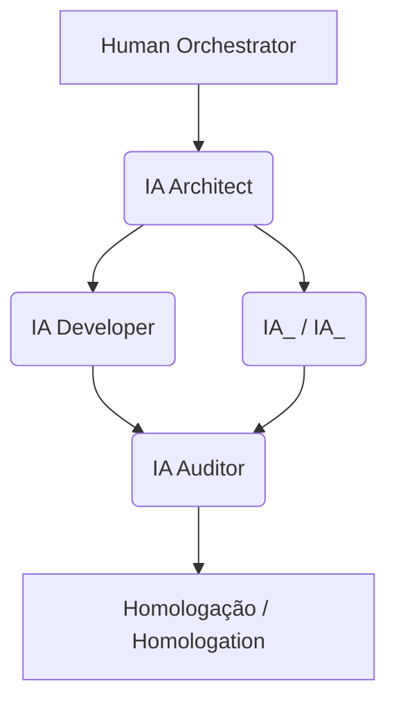

---
# ===============================================================
# METADADOS DE GOVERNANÇA (PARA O PIPELINE)
# ===============================================================
framework_name: "CrisAI"
framework_acronym: "CRIS"
framework_meaning: "Cognitive Responsible Innovation System"
framework_tagline: "Inovação Cognitiva com Responsabilidade e Propósito"
framework_version: "1.4" 
framework_named_for: "Cris Vicenzo"
title_pt: "PROTOCOLO DE GOVERNANÇA IA-HUMANO (TEMPLATE CONSOLIDADO)"
title_en: "AI–HUMAN GOVERNANCE PROTOCOL (CONSOLIDATED TEMPLATE)"
language_support: ["pt-BR", "en-US"]

# COMPATIBILIDADE E RASTREABILIDADE
compatibility:
  derived_from_yaml: "PROTOCOLO_GOVERNANCA_IA_HUMANO_TEMPLATE_v1.4.yaml"
  derived_from_md:
    - "PROTOCOLO_GOVERNANCA_IA_HUMANO_TEMPLATE_v1.0.md"
    - "PROTOCOLO_GOVERNANCA_IA_HUMANO_TEMPLATE_v1.3.2.md"
  backward_compatible_with: ["v1.0", "v1.3", "v1.3.1", "v1.3.2"]

# IDENTIDADE CORPORATIVA
organization: "Vicenzo_Corp"
maintainer: "Orquestrador_Humano"
status: "Template Aprovado"
framework_version: "v1.4"

# ===============================================================
# DADOS DE INSTANCIAÇÃO (A SER PREENCHIDO PELO ORQUESTRADOR)
# ===============================================================
project_name: "<NOME_DO_PROJETO>"
project_code: "<CODIGO_INTERNO>"  # Obrigatório em contexto corporativo
created_by: "Human_Orchestrator"
approved_by: "Junta Validadora (Sistemas, Negócio, Compliance)"
created_at: "<AAAA-MM-DD>"
status: "Em Configuração"
registry_path: "{{project_path}}/protocolos/"
context_scope: "project_specific"
manifest_reference: "<MANIFESTO_<PROJETO>_vX.Y.yaml ou null se não aplicável>"
---

# 🧭 1. PROPÓSITO E ESCOPO (PURPOSE & SCOPE)

**PT:** Este protocolo define as regras de governança IA-Humano específicas do projeto **`<NOME_DO_PROJETO>`**. Ele herda e implementa os princípios do `PROTOCOLO_METODOLOGICO_CORPORATIVO_IA_HUMANO_v1.0.md` e `PROTOCOLO_GOVERNANCA_IA_HUMANO_v1.3.md`.

**EN:** This protocol defines the specific AI-Human governance rules for the **`<PROJECT_NAME>`** project. It inherits and implements the principles from `PROTOCOLO_METODOLOGICO_CORPORATIVO_IA_HUMANO_v1.0.md` and `PROTOCOLO_GOVERNANCA_IA_HUMANO_v1.3.md`.

- **PT - Objetivo Estratégico:** `<ex: Reduzir o tempo de validação de documentos fiscais em 30%>`
- **EN - Strategic Goal:** `<ex: Reduce document validation time by 30%>`

- **PT - Escopo Inicial:** `<resumo dos principais módulos ou entregáveis>`
- **EN - Initial Scope:** `<summary of main modules or deliverables>`

---

# 🏛️ 2. BLOCOS DE GOVERNANÇA (GOVERNANCE BLOCKS)

**PT:** Este protocolo é governado pelos 4 blocos definidos no `v1.4.yaml`.  
**EN:** This protocol is governed by the 4 blocks defined in `v1.4.yaml`.

## 2.1. Bloco 1: SSoT e Hierarquia (SSoT & Hierarchy)

**PT:** Define onde os artefatos mestres estão e onde este projeto será instanciado, conforme o `ssot.instantiation_path_template`.

**EN:** Defines where master artifacts are and where this project will be instantiated, as per the `ssot.instantiation_path_template`.

## 2.2. Bloco 2: Regras de Governança (Governance Rules & SLAs)

**PT:** Este projeto adere aos seguintes SLAs e regras contratuais:
- **Revisão Humana:** 48 horas
- **Retrabalho IA:** 24 horas
- **Auditoria Contínua:** 72 horas
- **Limite de Contexto:** 500 palavras por agente
- **Duração Máxima por Componente:** 16 horas
- **Campos Obrigatórios:** Todos os `required_fields_on_instantiation` devem ser preenchidos

**EN:** This project adheres to the following SLAs and contractual rules:
- **Human Review:** 48 hours
- **AI Rework:** 24 hours
- **Continuous Audit:** 72 hours
- **Context Limit:** 500 words per agent
- **Max Component Duration:** 16 hours
- **Required Fields:** All `required_fields_on_instantiation` must be completed

## 2.3. Bloco 3: Automação e Pipeline (Automation & Pipeline)

**PT:** O pipeline de CI/CD executará os seguintes *hooks* para este projeto:
- `validate_structure` - Valida estrutura de diretórios e arquivos
- `register_manifest` - Registra manifesto no ssot_registry
- `create_audit_log` - Cria logs de auditoria
- `generate_hash_sha256` - Gera hashes de integridade

**EN:** The CI/CD pipeline will execute the following hooks for this project:
- `validate_structure` - Validates directory and file structure
- `register_manifest` - Registers manifest in ssot_registry
- `create_audit_log` - Creates audit logs
- `generate_hash_sha256` - Generates integrity hashes

## 2.4. Bloco 4: Agentes e Atores (Agents & Actors)

**PT:** Define os papéis de IA e Humanos que atuarão neste projeto.  
**EN:** Defines the AI and Human roles that will act on this project.

---

# 🧠 3. AGENTES DO PROJETO (PROJECT AGENTS)

## 3.1. Agentes IA (Padrão / Standard)

**PT:** Agentes universais obrigatórios (herdados do protocolo corporativo):  
**EN:** Mandatory universal agents (inherited from corporate protocol):

- **IA_Architect:** 
  - **PT:** Desenha *blueprints* técnicos e arquitetura do sistema
  - **EN:** Designs technical blueprints and system architecture
  - **Contexto / Context:** `<PROJETO>_CONCEITO_TECH.md` (master completo)

- **IA_Developer:**
  - **PT:** Implementa *blueprints*, código e integrações
  - **EN:** Implements blueprints, code and integrations
  - **Contexto / Context:** `<PROJETO>_TECH.md` (subset técnico)

- **IA_Auditor:**
  - **PT:** Valida integridade (hashes, diffs) e conformidade
  - **EN:** Validates integrity (hashes, diffs) and compliance
  - **Contexto / Context:** Todos os artefatos / All artifacts

- **IA_Governance:**
  - **PT:** Monitora conformidade protocolar e consistência documental
  - **EN:** Monitors protocol compliance and document consistency
  - **Contexto / Context:** Todos os artefatos corporativos e de projeto / All corporate and project artifacts

## 3.2. Agentes IA (Opcionais/Específicos do Projeto / Optional/Project-Specific)

**PT:** Adicione IAs especializadas necessárias para `<NOME_DO_PROJETO>`:  
**EN:** Add specialized AIs needed for `<PROJECT_NAME>`:

```yaml
agents_ia_extended:
  - id: IA_<Role>
    role: "<Descrição do papel / Role description>"
    scope: "<Escopo de atuação / Scope of action>"
    context: "<PROJETO>_<ESPECIALIDADE>.md"
    justification: "<Por que este projeto precisa deste agente? / Why this project needs this agent?>"
```

**Exemplos / Examples:**

```yaml
# Exemplo 1: Projeto com módulo fiscal
agents_ia_extended:
  - id: IA_Fiscal
    role: "Especialista em Tributação e Compliance / Tax and Compliance Specialist"
    scope: "Validar regras fiscais, NF-e, ST, MVA / Validate tax rules, NF-e, ST, MVA"
    context: "DOCK_MANAGER_v13_EXT_FISCAL.md"
    justification: "Projeto requer conformidade fiscal complexa / Project requires complex tax compliance"

# Exemplo 2: Projeto e-commerce
agents_ia_extended:
  - id: IA_Payments
    role: "Especialista em Pagamentos / Payments Specialist"
    scope: "Integração com gateways, PCI-DSS / Gateway integration, PCI-DSS"
    context: "ECOMMERCE_PAYMENTS.md"
    justification: "Múltiplos gateways e compliance PCI-DSS / Multiple gateways and PCI-DSS compliance"
```

## 3.3. Atores Humanos (Human Actors)

**PT:** Junta Validadora Multidisciplinar:  
**EN:** Multidisciplinary Validation Board:

```yaml
human_stakeholders:
  validador_negocio:
    name: "<Nome ou cargo / Name or role>"
    responsibility: "Alinhamento estratégico / Strategic alignment"
  
  validador_tecnico:
    name: "<Nome ou cargo / Name or role>"
    responsibility: "Integridade técnica / Technical integrity"
  
  validador_conformidade:
    name: "<Nome ou cargo / Name or role>"
    responsibility: "Aderência normativa / Regulatory compliance"
  
  validador_usuario:
    name: "<Nome ou cargo / Name or role>"
    responsibility: "Aplicabilidade e UX / Applicability and UX"
  
  orquestrador_humano:
    name: "<Nome / Name>"
    responsibility: "Supervisão geral e aprovação / Overall supervision and approval"
```

---

# 📦 4. COMPONENTIZAÇÃO (COMPONENTIZATION)

## 4.1. Regras Gerais (General Rules)

**PT:**
- Duração máxima: 16h de execução IA
- Input: contexto YAML + trecho do master
- Output: arquivo `.md` versionado com SHA256
- Validação: automática (IA) + humana (dupla camada)

**EN:**
- Max duration: 16h of AI execution
- Input: YAML context + excerpt from master
- Output: versioned `.md` file with SHA256
- Validation: automatic (AI) + human (dual layer)

## 4.2. Componentes deste Projeto (This Project's Components)

**PT:** Liste os blocos técnicos principais:  
**EN:** List the main technical blocks:

```yaml
components:
  - name: "<COMPONENTE_1>"
    source: "<PROJETO>_CONCEITO_TECH.md (Seções <X-Y>)"
    output: "<PROJETO>_<COMPONENTE>.md"
    ia_responsible: "<IA_Role>"
    max_duration: "16h"
    token_economy: "<X%>"
  
  - name: "<COMPONENTE_2>"
    source: "<PROJETO>_CONCEITO_TECH.md (Seções <X-Y>)"
    output: "<PROJETO>_<COMPONENTE>.md"
    ia_responsible: "<IA_Role>"
    max_duration: "16h"
    token_economy: "<X%>"
```

---

# 🎯 5. HIERARQUIA SSoT (SSoT HIERARCHY)

## 5.1. Documento Master

**PT:**
- **Arquivo:** `<PROJETO>_CONCEITO_TECH.md`
- **Papel:** Single Source of Truth (SSoT)
- **Conteúdo:** Conceito integral com todas as seções
- **Edição:** Apenas por humanos

**EN:**
- **File:** `<PROJETO>_CONCEITO_TECH.md`
- **Role:** Single Source of Truth (SSoT)
- **Content:** Complete concept with all sections
- **Editing:** Humans only

## 5.2. Documentos Derivados (Derived Documents)

**PT:** Subconjuntos otimizados para IAs específicas:  
**EN:** Optimized subsets for specific AIs:

```yaml
derived_documents:
  - file: "<PROJETO>_TECH.md"
    derived_from: "<PROJETO>_CONCEITO_TECH.md"
    scope: "Seções <X-Y> / Sections <X-Y>"
    ia_role: "IA_Developer"
    token_economy: "<X%>"
  
  - file: "<PROJETO>_<ESPECIALIDADE>.md"
    derived_from: "<PROJETO>_CONCEITO_TECH.md"
    scope: "<Descrição / Description>"
    ia_role: "IA_<Role>"
    token_economy: "<X%>"
```

## 5.3. Governança (Governance)

**PT:**
- Derivados são reconstruídos automaticamente via IA
- Logs mantidos em `/governance/projects/<projeto>/auditoria/ssot/`
- Headers YAML com `derived_from` obrigatório

**EN:**
- Derived docs are automatically rebuilt via AI
- Logs kept in `/governance/projects/<project>/auditoria/ssot/`
- YAML headers with mandatory `derived_from`

---

# ⏱️ 6. SLAs E FLUXOS (SLAs & WORKFLOWS)

## 6.1. SLAs Padrão (Standard SLAs)

**PT / EN:**

| Etapa / Stage | Responsável / Responsible | SLA | Ação / Action |
|---------------|---------------------------|-----|---------------|
| Execução IA → Revisão Humana / AI Execution → Human Review | Human Orchestrator | 48h | Feedback obrigatório / Mandatory feedback |
| Retrabalho IA / AI Rework | Mesma IA / Same AI | 24h | Novo commit com diff log / New commit with diff log |
| Auditoria Contínua / Continuous Audit | IA Auditor | 72h | Emissão de relatório / Report issuance |

## 6.2. Fluxo de Entrega (Delivery Flow)

**PT / EN:**



---

# 🛠️ 7. STACK TECNOLÓGICO (TECHNOLOGY STACK)

**PT:** Defina as tecnologias específicas deste projeto:  
**EN:** Define the specific technologies for this project:

```yaml
stack:
  backend:
    language: "<linguagem / language>"
    framework: "<framework>"
    version: "<versão / version>"
    db_primary: "<banco / database>"
    db_cache: "<cache>"
  
  frontend:
    framework: "<framework>"
    version: "<versão / version>"
    styling: "<sistema de estilos / styling system>"
  
  messaging:
    primary: "<sistema / system>"
    alternative: "<alternativa / alternative>"
  
  infrastructure:
    containerization: "<Docker, Podman>"
    orchestration: "<Kubernetes, Docker Swarm>"
    ci_cd: "<GitLab CI, GitHub Actions>"
    observability:
      metrics: "<Prometheus, Datadog>"
      dashboards: "<Grafana, Kibana>"
      logs: "<ELK, Loki>"
```

---

# 🔒 8. SEGURANÇA E COMPLIANCE (SECURITY & COMPLIANCE)

## 8.1. Autenticação e Autorização (Authentication & Authorization)

**PT:**
- **AuthN:** JWT/OAuth2
- **AuthZ:** RBAC (Role-Based Access Control)
- **Criptografia em trânsito:** TLS 1.3
- **Criptografia em repouso:** AES-256
- **Secrets:** KMS/Vault

**EN:**
- **AuthN:** JWT/OAuth2
- **AuthZ:** RBAC (Role-Based Access Control)
- **Encryption in transit:** TLS 1.3
- **Encryption at rest:** AES-256
- **Secrets:** KMS/Vault

## 8.2. Políticas de Compliance

**PT / EN:**
- SSoT Integrity
- Dual Validation (IA + Human)
- Traceability Hash (SHA256)
- Data Retention (5 years default)
- LGPD/GDPR Compliance (if applicable)

---

# 📊 9. OBSERVABILIDADE (OBSERVABILITY)

## 9.1. Métricas (Metrics)

**PT / EN:**
- `throughput` - requisições/segundo / requests/second
- `latency` - p50, p95, p99
- `error_rate` - % de erros / % of errors
- `queue_depth` - tamanho da fila / queue size

## 9.2. Ferramentas (Tools)

**PT / EN:**
- **Métricas / Metrics:** `<Prometheus, Datadog>`
- **Dashboards:** `<Grafana, Kibana>`
- **Logs:** `<ELK, Loki>`
- **Tracing:** `<Jaeger, OpenTelemetry>`

---

# ✅ 10. CRITÉRIOS DE ACEITE (ACCEPTANCE CRITERIA)

**PT:** Uma entrega é aprovada quando:  
**EN:** A delivery is approved when:

- ✅ **PT:** Cumpre escopo YAML / **EN:** Fulfills YAML scope
- ✅ **PT:** Passa validação IA Auditor / **EN:** Passes IA Auditor validation
- ✅ **PT:** Dentro dos SLAs / **EN:** Within SLAs
- ✅ **PT:** Hash confirmado por 2 entidades (IA + humano) / **EN:** Hash confirmed by 2 entities (AI + human)

**PT:** Critérios adicionais específicos do projeto:  
**EN:** Additional project-specific criteria:

```yaml
additional_criteria:
  - "<critério 1 / criterion 1>"
  - "<critério 2 / criterion 2>"
```

---

# 🔄 11. POLÍTICA DE ROLLBACK (ROLLBACK POLICY)

**PT:** Em caso de inconsistência:  
**EN:** In case of inconsistency:

1. **PT:** Criação de branch `rollback/[data]/[hash]`  
   **EN:** Create branch `rollback/[date]/[hash]`

2. **PT:** Restauração automática via SHA256  
   **EN:** Automatic restoration via SHA256

3. **PT:** Log completo arquivado em `/audits/rollback/`  
   **EN:** Complete log archived in `/audits/rollback/`

4. **PT:** IA Auditor notifica Human Orchestrator  
   **EN:** IA Auditor notifies Human Orchestrator

5. **PT:** Branch de release bloqueada até revisão  
   **EN:** Release branch blocked until review

---

# 📝 12. CHANGELOG DO PROJETO (PROJECT CHANGELOG)

**PT / EN:**

```yaml
changelog:
  v<X.Y>:
    date: "<YYYY-MM-DD>"
    changes:
      - "<mudança 1 / change 1>"
      - "<mudança 2 / change 2>"
    documents_updated:
      - "<documento / document>"
```

---

# 📚 13. REFERÊNCIAS (REFERENCES)

## 13.1. Documentos Corporativos (Corporate Documents)

- `PROTOCOLO_METODOLOGICO_CORPORATIVO_IA_HUMANO_v1.0.md`
- `PROTOCOLO_GOVERNANCA_IA_HUMANO_v1.3.md`
- `MANIFESTO_GOVERNANCA_v1.4.yaml`
- `CONTEXT_MAP_GOVERNANCA_v1.4.yaml`

## 13.2. Documentos deste Projeto (This Project's Documents)

- `<PROJETO>_CONCEITO_TECH.md` (SSoT Master)
- `README_<PROJETO>.md`
- `Blueprint_<PROJETO>_<FASE>.md`

---

# 🎯 14. CONCLUSÃO (CONCLUSION)

**PT:**
Este protocolo **complementa e estende** o protocolo corporativo v1.3,
adicionando as especificidades necessárias para o desenvolvimento do projeto **`<NOME_DO_PROJETO>`**.

**EN:**
This protocol **complements and extends** the corporate protocol v1.3,
adding the necessary specificities for the development of the **`<PROJECT_NAME>`** project.

**PT - Próximos passos:**  
**EN - Next steps:**

1. **PT:** Validação pela Junta Validadora / **EN:** Validation by the Validation Board
2. **PT:** Aprovação pelo Orquestrador Humano / **EN:** Approval by Human Orchestrator
3. **PT:** Registro no MANIFESTO_GOVERNANCA_v1.4.yaml / **EN:** Registration in MANIFESTO_GOVERNANCA_v1.4.yaml
4. **PT:** Início da Fase 1 (Blueprint) / **EN:** Start of Phase 1 (Blueprint)

---

> **Framework:** Governança IA-Humano v1.4 · **Projeto / Project:** `<NOME_DO_PROJETO>` · **Status:** `<draft/active/archived>`
