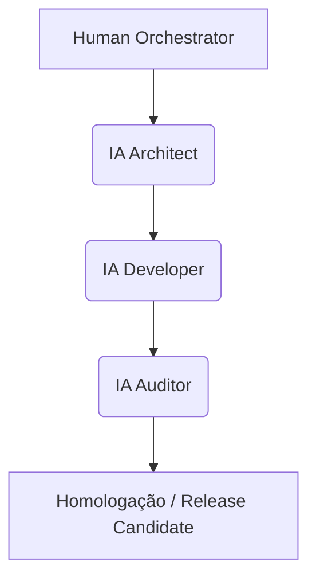
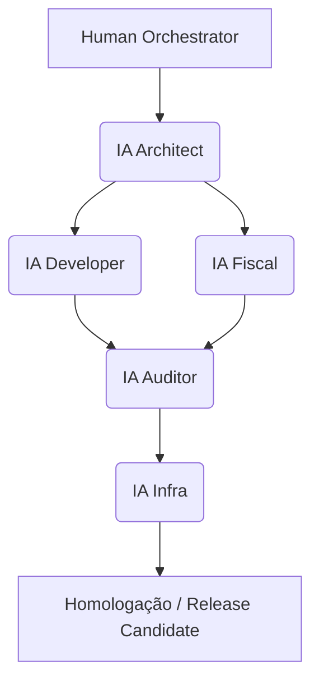
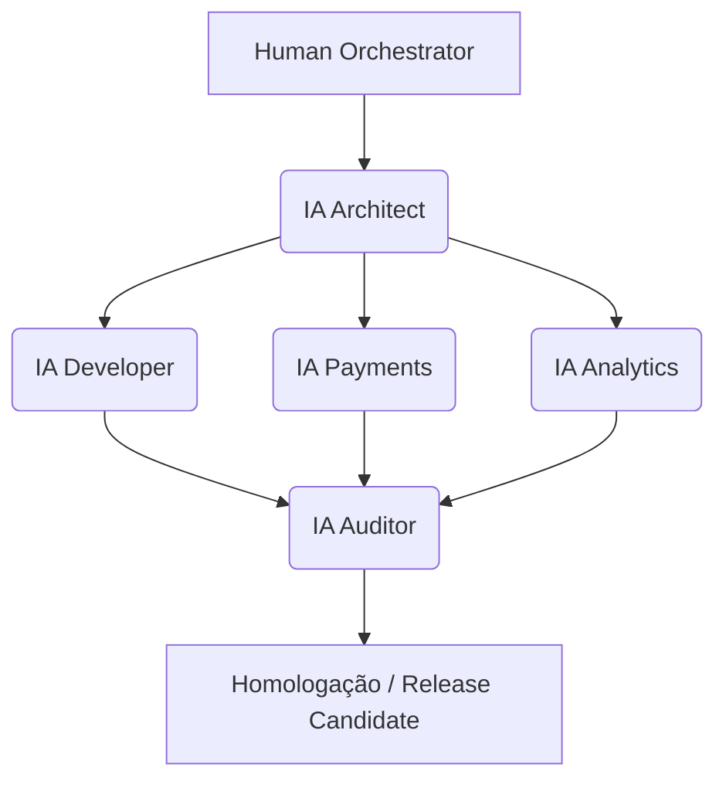

# 🤖 PROTOCOLO DE GOVERNANÇA IA–HUMANO v<X.Y>
## Projeto: <NOME_DO_PROJETO>

---

## 📋 INSTRUÇÕES DE PREENCHIMENTO

**Este é um template genérico para criação de protocolos específicos de projeto.**

- Substitua `<PLACEHOLDERS>` pelos valores específicos do seu projeto
- Este protocolo **HERDA** do `PROTOCOLO_GOVERNANCA_IA_HUMANO_v1.3.md` (corporativo)
- Adicione apenas **especificidades do projeto** (não repita o que já está no protocolo corporativo)
- Use o DockManager como referência (consultar `/governance/projects/dockmanager/`)

**O que incluir neste protocolo:**
- ✅ Papéis IA adicionais específicos do projeto (ex: IA_Fiscal, IA_Negocios)
- ✅ SLAs customizados (se diferentes dos corporativos)
- ✅ Componentização específica (blocos técnicos do projeto)
- ✅ Padrões de código e design system específicos
- ✅ Estrutura SSoT particular do projeto

**O que NÃO incluir (já está no protocolo corporativo):**
- ❌ Papéis IA universais (Architect, Developer, Auditor, Governance)
- ❌ SLAs padrão (48h revisão, 24h retrabalho, 16h componente)
- ❌ Política de rollback (SHA256, branch strategy)
- ❌ Segurança geral (tokens, sandboxing)

---

## 1️⃣ OBJETIVO

Garantir a **construção segura, rastreável e eficiente** do projeto **<NOME_DO_PROJETO>** 
por múltiplas IAs sob orquestração humana.

**Escopo do Projeto:**
<Descreva brevemente o que o projeto faz, seus objetivos principais e domínio de negócio>

**Exemplo (DockManager):**
> Plataforma Low-Code de Gestão Logística com motor de workflows, 
> integração ERP/WMS/TMS e módulo fiscal especializado.

**Herança:**
Este protocolo **herda e estende** o `PROTOCOLO_GOVERNANCA_IA_HUMANO_v1.3.md` (corporativo).
Apenas especificidades do projeto <NOME_DO_PROJETO> são documentadas aqui.

---

## 2️⃣ PAPÉIS E RESPONSABILIDADES

### 2.1 Papéis Universais (Herdados)
Os papéis abaixo são **herdados do protocolo corporativo** e aplicam-se a este projeto:

| Papel | Responsabilidade Central | Acesso Principal |
|-------|--------------------------|------------------|
| 🧑‍💼 **Human Orchestrator** | Define escopo, supervisiona contexto e aprova entregas | Todos os artefatos |
| 🧠 **IA Architect** | Estrutura conceitos, blueprint e arquitetura técnica | `<PROJETO>_CONCEITO_TECH.md`, README |
| ⚙️ **IA Developer** | Implementa blocos técnicos e fluxos de código | `<PROJETO>_TECH.md` |
| 🧩 **IA Auditor** | Executa auditorias automáticas, valida SHA256 | Todos os artefatos |
| 📊 **IA Governance** | Monitora conformidade protocolar e consistência documental | Todos os artefatos corporativos e de projeto |

*(Consulte `PROTOCOLO_GOVERNANCA_IA_HUMANO_v1.3.md` para descrição completa)*

### 2.2 Papéis Adicionais (Específicos deste Projeto)

**Adicione aqui APENAS papéis específicos do seu projeto:**

| Papel | Responsabilidade Central | Acesso Principal | Justificativa |
|-------|--------------------------|------------------|---------------|
| <PAPEL_1> | <Descrição> | `<ARQUIVO>.md` | <Por que este projeto precisa deste papel?> |
| <PAPEL_2> | <Descrição> | `<ARQUIVO>.md` | <Por que este projeto precisa deste papel?> |

**Exemplo (DockManager):**

| Papel | Responsabilidade Central | Acesso Principal | Justificativa |
|-------|--------------------------|------------------|---------------|
| 🧾 **IA Fiscal** | Gere módulos tributários, fiscais e regulatórios | `DOCK_MANAGER_v13_EXT_FISCAL.md` | Projeto requer conformidade fiscal (NF-e, ST, MVA) |
| 🧰 **IA Infra** | Configura pipelines, containerização e monitoração | Infra Bloco 5 e logs de CI/CD | Sistema complexo requer infraestrutura dedicada |

**Exemplo (outro projeto - e-commerce):**

| Papel | Responsabilidade Central | Acesso Principal | Justificativa |
|-------|--------------------------|------------------|---------------|
| 💳 **IA Payments** | Integra gateways de pagamento e compliance PCI-DSS | `ECOMMERCE_PAYMENTS.md` | Múltiplos gateways com regulações específicas |
| 📊 **IA Analytics** | Pipelines de dados, métricas de negócio, BI | `ECOMMERCE_ANALYTICS.md` | Sistema orientado a métricas de conversão |

---

## 3️⃣ COMPONENTIZAÇÃO ESPECÍFICA

### 3.1 Estrutura Geral (Herdada)
- Duração máxima: **16h de execução IA**
- Input: contexto YAML + trecho do master
- Output: arquivo `.md` versionado com SHA256
- Validação: automática + humana (dupla camada)

*(Consulte protocolo corporativo para detalhes completos)*

### 3.2 Componentes Específicos deste Projeto

**Liste os blocos técnicos principais do projeto:**

| Componente | Fonte (Master) | Output | IA Responsável | SLA Customizado |
|------------|----------------|--------|----------------|-----------------|
| <COMPONENTE_1> | Seções <X-Y> do master | `<ARQUIVO>_<COMPONENTE>.md` | <IA_Role> | <SLA se diferente do padrão> |
| <COMPONENTE_2> | Seções <X-Y> do master | `<ARQUIVO>_<COMPONENTE>.md` | <IA_Role> | <SLA se diferente do padrão> |

**Exemplo (DockManager):**

| Componente | Fonte (Master) | Output | IA Responsável | SLA Customizado |
|------------|----------------|--------|----------------|-----------------|
| DockBot Workflow Engine | Seções 2-11 | `DOCK_MANAGER_v13_TECH.md` | IA_Developer | 16h (padrão) |
| Módulo Fiscal | Seção 5.5.4 + Extensão | `DOCK_MANAGER_v13_EXT_FISCAL.md` | IA_Fiscal | 12h (menor complexidade) |
| Infraestrutura (Bloco 5) | Seção 10 | `Blueprint_Infra_v1.0.md` | IA_Infra | 16h (padrão) |

**Exemplo YAML:**
```yaml
component:
  name: "<COMPONENTE>"
  source: "<PROJETO>_CONCEITO_TECH.md (Seções <X-Y>)"
  output: "<PROJETO>_<COMPONENTE>.md"
  max_duration: "16h"
  validator: ["ia_auditor", "human_orchestrator"]
```

---

## 4️⃣ CONTEXT PACK E CONTROLE DE TOKENS

### 4.1 Regras Gerais (Herdadas)
- Cada IA opera com **Context Pack** de até **500 palavras**
- Inclui: trecho do master + instrução + YAML + critérios de aceite
- Benefícios: economia de 60% de tokens, controle semântico, isolamento

*(Consulte protocolo corporativo para detalhes completos)*

### 4.2 Otimizações Específicas deste Projeto

**Documente economias ou estratégias específicas:**

**Exemplo (DockManager):**
- Subset Técnico (`TECH.md`): **40% economia** de tokens vs. master completo
- Subset Fiscal (`EXT_FISCAL.md`): **85% economia** de tokens vs. master completo
- IA_Fiscal opera APENAS com módulo fiscal → alta especialização

**Exemplo (outro projeto):**
- Subset Frontend (`FRONTEND.md`): 30% economia, foco em UI/UX
- Subset Backend (`BACKEND.md`): 35% economia, foco em APIs/DB

---

## 5️⃣ FLUXO DE ENTREGA MULTIAGENTE

### 5.1 Fluxo Padrão (Herdado)



*(Consulte protocolo corporativo para detalhes completos)*

### 5.2 Fluxo Customizado deste Projeto

**Adicione etapas ou agentes específicos:**

**Exemplo (DockManager - com IA Fiscal e IA Infra):**



**Exemplo (e-commerce - com IA Payments e IA Analytics):**



---

## 6️⃣ SLA DE EXECUÇÃO E REVISÃO

### 6.1 SLAs Padrão (Herdados)

| Etapa | Responsável | SLA | Ação |
|--------|--------------|-----|------|
| Execução IA → Revisão Humana | Human Orchestrator | 48h | Feedback obrigatório |
| Retrabalho IA | Mesma IA | 24h | Novo commit com diff log |
| Auditoria Contínua | IA Auditor | 72h | Emissão de relatório automático |

*(Consulte protocolo corporativo para SLAs completos)*

### 6.2 SLAs Customizados deste Projeto

**Adicione APENAS SLAs diferentes dos padrão:**

**Exemplo (DockManager):**

| Etapa | Responsável | SLA | Ação | Justificativa |
|--------|--------------|-----|------|---------------|
| Validação Fiscal | IA Fiscal | 12h | Validação tributária acelerada | Módulo menor e isolado |
| Deploy Infra | IA Infra | 24h | Atualização de dashboard | Infraestrutura crítica |

**Exemplo (sistema financeiro):**

| Etapa | Responsável | SLA | Ação | Justificativa |
|--------|--------------|-----|------|---------------|
| Auditoria de Segurança | IA Security | 24h | Scan de vulnerabilidades | Sistema PCI-DSS compliance |

---

## 7️⃣ PADRÕES DE CÓDIGO E DESIGN SYSTEM

### 7.1 Padrões Gerais (Herdados)
- ESLint + Prettier + Conventional Commits
- Microfronts e Microsserviços containerizados
- CI/CD com observabilidade

*(Consulte protocolo corporativo para padrões completos)*

### 7.2 Stack Tecnológico deste Projeto

**Defina as tecnologias ESPECÍFICAS deste projeto:**

**Exemplo (DockManager):**
```yaml
stack_tecnologico:
  backend:
    language: "Node.js"
    framework: "NestJS"
    db_primary: "PostgreSQL"
    db_cache: "Redis"
  
  frontend:
    framework: "React"
    styling: "Tailwind CSS + Shadcn/UI"
  
  mensageria:
    primary: "RabbitMQ"
    alternative: "Kafka"
  
  infra:
    containerization: "Docker"
    orchestration: "Kubernetes"
    observability: "Prometheus + Grafana + ELK"
```

**Exemplo (outro projeto - Python/Django):**
```yaml
stack_tecnologico:
  backend:
    language: "Python 3.11"
    framework: "Django 5.0"
    db_primary: "MySQL 8.0"
    db_cache: "Redis"
  
  frontend:
    framework: "Vue.js 3"
    styling: "Bootstrap 5"
```

### 7.3 Convenções de Nomenclatura

**Defina padrões específicos:**

**Exemplo:**
- Arquivos: `<projeto>_<tipo>_v<versao>.md`
- Branches: `feature/<nome>`, `bugfix/<nome>`, `release/<versao>`
- Commits: Conventional Commits (`feat:`, `fix:`, `docs:`)

---

## 8️⃣ HIERARQUIA SSoT (SINGLE SOURCE OF TRUTH)

### 8.1 Estrutura SSoT deste Projeto

**Defina a hierarquia documental específica:**

```yaml
ssot_hierarchy:
  master: "<PROJETO>_CONCEITO_TECH.md"
  derived:
    - file: "<PROJETO>_TECH.md"
      scope: "Seções <X-Y>"
      ia_role: "IA_Developer"
      token_economy: "<X%>"
    
    - file: "<PROJETO>_<ESPECIALIDADE>.md"
      scope: "<Descrição do escopo>"
      ia_role: "IA_<Especializada>"
      token_economy: "<X%>"
```

**Exemplo (DockManager):**

```yaml
ssot_hierarchy:
  master: "DOCK_MANAGER_v13_CONCEITO_TECH.md"
  derived:
    - file: "DOCK_MANAGER_v13_TECH.md"
      scope: "Seções 2-11 (técnicas)"
      ia_role: "IA_Developer"
      token_economy: "40%"
    
    - file: "DOCK_MANAGER_v13_EXT_FISCAL.md"
      scope: "Seção 5.5.4 + extensões tributárias"
      ia_role: "IA_Fiscal"
      token_economy: "85%"
```

### 8.2 Governança e Auditoria SSoT

**Regras específicas (se diferentes do padrão):**

- Apenas o documento **master** pode ser editado por humanos
- Derivados são reconstruídos automaticamente via IA sob controle de auditoria
- Logs mantidos em `/governance/projects/<projeto>/auditoria/ssot/`

---

## 9️⃣ JUNTA VALIDADORA

### 9.1 Composição da Junta

**Defina os validadores humanos deste projeto:**

| Função | Responsabilidade | Especialidade |
|--------|------------------|---------------|
| Validador de Negócio | Alinhamento estratégico e valor | <Nome/Cargo> |
| Validador Técnico | Integridade e eficiência técnica | <Nome/Cargo> |
| Validador de Conformidade | Aderência normativa | <Nome/Cargo> |
| Validador de Usuário | Aplicabilidade e UX | <Nome/Cargo> |

**Exemplo (DockManager):**

| Função | Responsabilidade | Especialidade |
|--------|------------------|---------------|
| Validador de Negócio | Alinhamento logístico | Especialista em Operações |
| Validador Técnico | Arquitetura de sistemas | Arquiteto de Sistemas |
| Validador de Conformidade | Riscos e compliance fiscal | Analista de Riscos Tributários |
| Validador de Usuário | Experiência do operador de doca | Gestor de Operações Logísticas |

---

## 🔟 INFRAESTRUTURA E OBSERVABILIDADE

### 10.1 Padrões Gerais (Herdados)
- Topologia: Microservices + Gateways
- Monitoração: Prometheus / Grafana
- Deploy: Docker + Kubernetes

*(Consulte protocolo corporativo para detalhes completos)*

### 10.2 Especificidades deste Projeto

**Adicione requisitos ou configurações específicas:**

**Exemplo (DockManager):**
- **Logs centralizados**: ELK Stack com retenção de 90 dias
- **Alertas**: Webhooks para Slack (#dockmanager-alerts)
- **Backups**: Snapshots semanais com retenção de 6 meses

**Exemplo (sistema financeiro):**
- **Logs**: Imutáveis, criptografados (compliance SOX)
- **Alertas**: PagerDuty para incidentes críticos
- **Backups**: Diários com retenção de 7 anos

---

## 1️⃣1️⃣ CRITÉRIOS DE ACEITE ESPECÍFICOS

### 11.1 Critérios Gerais (Herdados)
- Cumpre escopo YAML
- Passa em validação IA Auditor
- Dentro dos SLAs
- Hash confirmado por 2 entidades

*(Consulte protocolo corporativo)*

### 11.2 Critérios Adicionais deste Projeto

**Adicione critérios específicos:**

**Exemplo (DockManager):**
- ✅ Integração com ERP testada (ambiente de staging)
- ✅ Validação fiscal aprovada por IA_Fiscal
- ✅ Performance: <200ms p95 para operações de workflow

**Exemplo (e-commerce):**
- ✅ Checkout completa em <3 segundos
- ✅ Integração com gateway de pagamento validada
- ✅ Testes de carga: 1000 req/s sem degradação

---

## 1️⃣2️⃣ REVISÕES E EVOLUÇÃO DO PROTOCOLO

| Versão | Data | Mudança Principal |
|---------|------|------------------|
| v<X.Y> | <YYYY-MM> | <Descrição da mudança> |

**Exemplo (DockManager):**

| Versão | Data | Mudança Principal |
|---------|------|------------------|
| v1.3 | 2025-11 | Adição da Seção 16 – Hierarquia SSoT |
| v1.2 | 2025-11 | Inclusão do Bloco 5, IA Infra, segurança |
| v1.1 | 2025-11 | Adição de SLAs, rollback e rastreabilidade |
| v1.0 | 2025-10 | Criação do protocolo específico DockManager |

---

## 1️⃣3️⃣ CONCLUSÃO

Este protocolo **complementa e estende** o `PROTOCOLO_GOVERNANCA_IA_HUMANO_v1.3.md` corporativo,
adicionando as especificidades necessárias para o desenvolvimento do projeto **<NOME_DO_PROJETO>**.

**Próximos passos:**
1. Validação pela Junta Validadora
2. Aprovação pelo Orquestrador Humano
3. Registro no `MANIFESTO_GOVERNANCA_v1.4.yaml`
4. Início da Fase 1 (Blueprint)

---

## 1️⃣4️⃣ REFERÊNCIAS

### Documentos Corporativos
- `PROTOCOLO_METODOLOGICO_CORPORATIVO_IA_HUMANO_v1.0.md`
- `PROTOCOLO_GOVERNANCA_IA_HUMANO_v1.3.md`
- `MANIFESTO_GOVERNANCA_v1.4.yaml`
- `CONTEXT_MAP_GOVERNANCA_v1.4.yaml`

### Documentos deste Projeto
- `<PROJETO>_CONCEITO_TECH.md` (SSoT Master)
- `README_<PROJETO>.md` (Documentação SSoT)
- `Blueprint_<PROJETO>_<FASE>.md` (Blueprints técnicos)

---

> **Framework:** Governança IA-Humano v1.4 · **Projeto:** <NOME_DO_PROJETO> · **Status:** <draft/active/archived>
